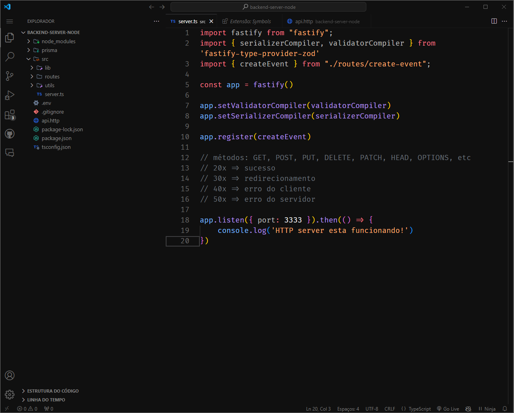
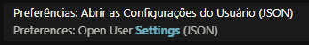

<!-- imagem -->
<h1 align="center">Minimal Black</h1>
<br />
<div align="center">
    
</div>


<!-- Sobre o projeto -->
## Sobre a ideia

Eu gostava muito do tema Dracula no vscode. Porém, assistindo uma aula da Rocketseat eu vi o professor utilizando um tema dark clean, e achei fantástico, então eu baixei e testei. Pórem, não era aquilo que eu imaginava. Então pensei, por quê não criar meu próprio tema?

Para isso eu lancei os seguintes requisitos:
* Deve ser agradável aos olhos;
* Deve ter os aspectos de cor do tema Dracula;

E depois de muita pesquisa e MUITOS testes eu cheguei no resultado que vocês estão vendo agora.

<!-- como usar -->
## Como utilizar

Primeiramente, tenha em seu vscode as seguintes extenções:
* [Min Theme](https://marketplace.visualstudio.com/items?itemName=miguelsolorio.min-theme)
* [Symbols](https://marketplace.visualstudio.com/items?itemName=miguelsolorio.symbols)

### Logo após, baixe a fonte a seguir:
* [FiraCode](https://github.com/tonsky/FiraCode)

<!-- VSCODE -->
## Dentro do vscode

### No seu menu pesquisar, digite o seguinte comando:
   ```sh
   >settings
   ```


### Agora, após todos os passos terem sido concluidos, basta colar o seguinte código dentro de settings:
```sh
  "editor.fontFamily": "Fira Code",
  "workbench.iconTheme": "symbols",
  "workbench.colorTheme": "Min Dark",
  "workbench.colorCustomizations": {
        "focusBorder": "#d6d6dd3d",
        "input.border": "#d6d6dd3d",
        "pickerGroup.border": "#6c6c6c",
        "badge.background": "#d6d6dd3d",
        "list.focusOutline": "#6163753d",
        "tab.activeBorderTop": "#d6d6dd3d",
        "editor.background": "#101010",
        "terminal.background": "#101010",
        "sideBar.background": "#101010",
        "statusBar.background": "#101010",
        "sideBarSectionHeader.background": "#101010",
        "welcomePage.background": "#101010",
        "titleBar.activeBackground": "#101010",
        "titleBar.inactiveBackground": "#101010",
        "titleBar.inactiveForeground": "#6c6c6c",
        "activityBar.background": "#101010",
        "activityBar.activeBorder": "#6c6c6c",
        "activityBar.inactiveForeground": "#6c6c6c",
        "input.background": "#101010",
        "dropdown.background": "#101010",
        "editorGroupHeader.tabsBackground": "#101010",
        "tab.activeBackground": "#101010",
        "tab.inactiveBackground": "#101010",
        "tab.inactiveForeground": "#6c6c6c",
        "tab.border": "#181818",
        "editorLineNumber.foreground": "#6c6c6c",
        "editorLineNumber.activeForeground": "#6c6c6c",
        "editorGroup.border": "#d6d6dd0c",
        "panel.background": "#101010",
        "panel.border": "#6c6c6c",
        "editorHoverWidget.background": "#101010",
        "editorHoverWidget.border": "#6c6c6c",
        "panelTitle.inactiveForeground": "#6c6c6c",
        "editorWidget.border": "#d6d6dd0c",
        "editorWidget.background": "#101010",
        "editor.lineHighlightBorder": "#d6d6dd3d",
        "button.background": "#d6d6dd3d",
        "input.placeholderForeground": "#6c6c6c",
        "list.activeSelectionBackground": "#d6d6dd0c",
        "list.hoverBackground": "#d6d6dd3d",
        "widget.border": "#d6d6dd0c",
        "editorSuggestWidget.selectedBackground": "#d6d6dd3d",
        "editorSuggestWidget.background": "#101010",
        "editorSuggestWidget.border": "#d6d6dd0c"
      },
   ```
O comando acima irá mudar somente as cores de seu VSCODE, não alterando a fonte, espaçamento etc.

### Caso queira deixar seu VSCODE que nem o do banner, copie e cole em settings o seguinte código:
   ```sh
   {
    "workbench.startupEditor": "newUntitledFile",
    "editor.fontFamily": "Fira Code",
    "editor.fontLigatures": true,
    "editor.fontSize": 18,
    "editor.lineHeight": 26,
    "workbench.iconTheme": "symbols",
    "editor.wordWrap": "on",
    "editor.rulers": [
        80,
        120
      ],
    "editor.parameterHints.enabled": false,
    "editor.renderLineHighlight": "gutter",
    "git.openRepositoryInParentFolders": "never",
    "git.enableSmartCommit": true,
    "tailwindCSS.emmetCompletions": true,
    "editor.stickyScroll.enabled": false,
    "workbench.colorTheme": "Min Dark",
    "workbench.editor.labelFormat": "short",
    "explorer.compactFolders": false,
    "breadcrumbs.enabled": false,
    "editor.minimap.enabled": false,
    "workbench.layoutControl.enabled": false,
    "window.menuBarVisibility": "compact",
    "settingsSync.ignoredSettings": [],
    
    "workbench.colorCustomizations": {
      "focusBorder": "#d6d6dd3d",
      "input.border": "#d6d6dd3d",
      "pickerGroup.border": "#6c6c6c",
      "badge.background": "#d6d6dd3d",
      "list.focusOutline": "#6163753d",
      "tab.activeBorderTop": "#d6d6dd3d",
      "editor.background": "#101010",
      "terminal.background": "#101010",
      "sideBar.background": "#101010",
      "statusBar.background": "#101010",
      "sideBarSectionHeader.background": "#101010",
      "welcomePage.background": "#101010",
      "titleBar.activeBackground": "#101010",
      "titleBar.inactiveBackground": "#101010",
      "titleBar.inactiveForeground": "#6c6c6c",
      "activityBar.background": "#101010",
      "activityBar.activeBorder": "#6c6c6c",
      "activityBar.inactiveForeground": "#6c6c6c",
      "input.background": "#101010",
      "dropdown.background": "#101010",
      "editorGroupHeader.tabsBackground": "#101010",
      "tab.activeBackground": "#101010",
      "tab.inactiveBackground": "#101010",
      "tab.inactiveForeground": "#6c6c6c",
      "tab.border": "#181818",
      "editorLineNumber.foreground": "#6c6c6c",
      "editorLineNumber.activeForeground": "#6c6c6c",
      "editorGroup.border": "#d6d6dd0c",
      "panel.background": "#101010",
      "panel.border": "#6c6c6c",
      "editorHoverWidget.background": "#101010",
      "editorHoverWidget.border": "#6c6c6c",
      "panelTitle.inactiveForeground": "#6c6c6c",
      "editorWidget.border": "#d6d6dd0c",
      "editorWidget.background": "#101010",
      "editor.lineHighlightBorder": "#d6d6dd3d",
      "button.background": "#d6d6dd3d",
      "input.placeholderForeground": "#6c6c6c",
      "list.activeSelectionBackground": "#d6d6dd0c",
      "list.hoverBackground": "#d6d6dd3d",
      "widget.border": "#d6d6dd0c",
      "editorSuggestWidget.selectedBackground": "#d6d6dd3d",
      "editorSuggestWidget.background": "#101010",
      "editorSuggestWidget.border": "#d6d6dd0c"
    },
   ```

<!-- Contato -->
## Contato

Meu LinkedIn - [guizeroum](https://www.linkedin.com/in/guizeroum/)
